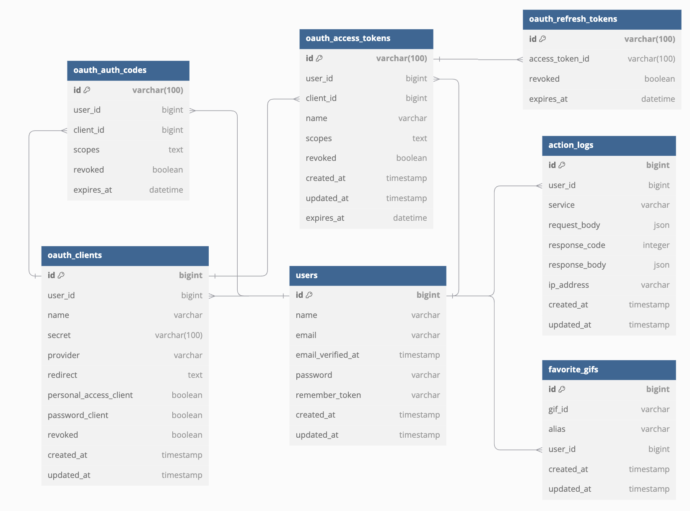

# ChallengePHP-APiRest

## Requirements
- **Docker Desktop**  
  If you don't have Docker, you can download the desktop client via: [Docker Desktop](https://www.docker.com/products/docker-desktop/).  

  Ensure Docker is running to set up the development environment.

---

## Steps to Install

### **Step 1: Clone the Repository**  
Clone the project repository to your local machine:  
```bash
git clone https://github.com/leo-dieguez91/ChallengePHP-APiRest.git
cd ChallengePHP-APiRest
```

### **Step 2: Build with Docker Compose**  
Build and start the Docker containers:  
```bash
docker-compose up --build -d
```
This command will:
1. Build and start the containers
2. Run the installation script automatically
3. Configure the environment
4. Install and configure Laravel with Passport
5. Set up the database
6. Configure the Giphy API key
- Install and compile frontend assets  

### **Step 4: Install Dependencies**  
This process takes a few minutes. Upon completion, you will see the message:  
**"Installation completed! 🚀"**

Congratulations! Your local environment should now be accessible at:  
- **http://localhost**

---

## Steps to Run

After the installation process, follow these steps:  
1. Open the Docker App.  
2. Start the containers.  
3. Test the API endpoints using Postman:
   - Import the Postman collection as described in the "Postman Integration" section.
   - Use the collection to interact with the following API endpoints:

     #### Auth
     - `POST /api/login`
     - `POST /api/register`
     - `POST /api/logout`

     #### GIFs
     - `GET /api/gifs/{{gif_id}}`
     - `POST /api/gifs/favorite`
     - `GET /api/gifs/search?query={{random_animal}}&limit=25&offset=`

     #### User
     - `GET /api/user`
     - `GET /api/user/favorites`
     - `DELETE /api/user/favorites/{{save_gif_id}}`

---

## Run Commands

To execute commands, use the **Sail gateway** configured with the alias `sh`. Below are some examples:

### **Artisan Commands**  
```bash
sh artisan migrate
sh artisan tinker
```

### **Composer Commands**  
```bash
sh composer require package-name
```

### **Container Management**  
```bash
sh up -d   # Start containers
sh down    # Stop containers
```

---

## Use Case Diagram


### Actors
- **Non-Authenticated User**: Can only register and login
- **Authenticated User**: Has access to all system features

### Features

#### Authentication
- Register
- Login
- Logout

#### GIFs Management
- Search GIFs (Requires: query | Optional: limit, offset) 
- View GIF by ID (Requires: gif_id)

#### Favorites Management
- Save GIF as Favorite (Requires: gif_id, alias)
- List Favorite GIFs
- Delete Favorite GIF (Requires: gif_id)

---

## Sequence Diagram


---

## Data Diagram (ERD)



---

## Dockerfile Configuration

Our project uses Laravel Sail, which provides a Docker-based development environment for Laravel applications.

### Main Services
- **Laravel Application**: Laravel 10.x with PHP 8.2
  ```dockerfile
  FROM sail-8.2/app
  # Laravel Sail default configuration
  ```

- **MySQL**: Database
  ```dockerfile
  FROM mysql:8.0
  # MySQL configuration
  ```

---

## Postman Integration
To test the API endpoints, you can use Postman:

1. **Download Postman**: If you don't have Postman installed, you can download it from [Postman's official website](https://www.postman.com/downloads/).

2. **Import the Postman Collection**: 
   - Open Postman.
   - Click on "Import" in the top left corner.
   - Select "Upload Files" and choose the Postman collection file `PHP API Challenge.postman_collection.json` located in the `postman/` directory of this repository.

3. **Set Up Environment Variables**:
   - In Postman, go to "Environments" and create a new environment.
   - Add a variable named `baseUrl` with the value `http://localhost/api`.

4. **Run Requests**:
   - Select the imported collection.
   - Ensure the correct environment is selected.
   - Run the requests to interact with the API.
